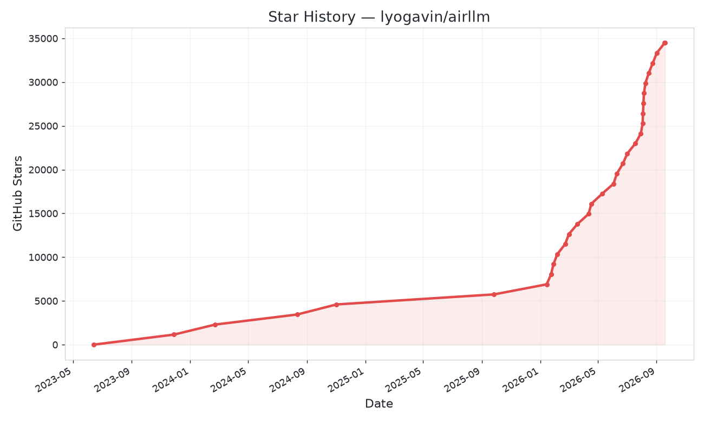

<p align="center">
  <a href="README.md">English</a> ·
  <a href="README_ru.md"><strong>Русский</strong></a> ·
  <a href="README_ja.md">日本語</a>
</p>

[**Быстрый старт**](#быстрый-старт) |
[**Настройки**](#настройки) |
[**MacOS**](#macos) |
[**Примеры notebook**](#пример-python-notebook) |
[**FAQ**](#faq)

**AirLLM** сильно снижает потребление памяти при инференсе: модели на **70B** параметров можно запускать на одной GPU с **4 GB** — без квантизации, дистилляции и прунинга. Даже **Llama 3.1 405B** — на **8 GB**, **DeepSeek-V3 (671B)** — примерно на **12 GB**, а **Kimi K3 (2.8T)** — крупнейшая открытая модель на сегодня — **менее чем на 4 GB**, потому что sparse MoE-модели подгружают экспертов по одному, а не весь слой сразу.

<a href="https://github.com/lyogavin/airllm/stargazers"></a>
[](https://pepy.tech/project/airllm)

[](https://github.com/LianjiaTech/BELLE/blob/main/LICENSE)
[](https://static.aicompose.cn/static/wecom_barcode.png?t=1671918938)
[](https://discord.gg/2xffU5sn)
[
](https://pypi.org/project/airllm/)
[](https://medium.com/@lyo.gavin)
[](https://gavinliblog.com)
[](https://patreon.com/gavinli)
[](https://github.com/sponsors/lyogavin)

## Рекомендации по AI-агентам

* [Best AI Game Sprite Generator](https://godmodeai.co)

* [Best AI Facial Expression Editor](https://crazyfaceai.com)

* [Bloome — build & run AI agent teams in the cloud, zero setup](https://bloome.im/app?ref=G6BYnov0&utm_medium=github&utm_source=lyogavin-airllm-ivor-202606)

## Обновления

[2026/07] Поддержка **Kimi K3 (2.8T)**: крупнейшая open-source модель на одной карте в **3.72 GB** VRAM (замер end-to-end на RTX 6000 Ada). Per-expert streaming загружает только тех экспертов, к которым токен реально роутится. У K3 три своих требования: `pip install compressed-tensors flash-attn` (код модели требует flash attention независимо от ваших настроек), сборка torch под CUDA 12 (готовых wheel flash-attn для CUDA 13 пока нет) и `transformers` 4.56.x (remote code не грузится на 5.x).

[2026/06] **v3.0**: поддержка FP8 + свежие модели. **DeepSeek-V3 (671B) на ~12 GB** и **Qwen3-235B на ~3 GB**, плюс Qwen3, Llama 3.x/4, DeepSeek V2/V3, Phi-4, Gemma и другие — всё через один `AutoModel`.

[2024/08/20] v2.11.0: поддержка Qwen2.5

[2024/08/18] v2.10.1: инференс на CPU. Поддержка non-sharded моделей. Спасибо @NavodPeiris!

[2024/07/30] Поддержка Llama3.1 **405B** ([example notebook](https://colab.research.google.com/github/lyogavin/airllm/blob/main/air_llm/examples/run_llama3.1_405B.ipynb)). Поддержка квантизации **8bit/4bit**.

[2024/04/20] Нативная поддержка Llama3. Llama3 70B на одной 4 GB GPU.

[2023/12/25] v2.8.2: MacOS — запуск LLM на 70B.

[2023/12/20] v2.7: AirLLMMixtral.

[2023/12/20] v2.6: AutoModel — автоопределение типа модели, класс указывать не нужно.

[2023/12/18] v2.5: prefetching (перекрытие загрузки модели и compute). ~10% ускорение.

[2023/12/03] поддержка **ChatGLM**, **QWen**, **Baichuan**, **Mistral**, **InternLM**!

[2023/12/02] поддержка safetensors. Топ-10 моделей open llm leaderboard.

[2023/12/01] airllm 2.0. Compression: **ускорение runtime до 3x!**

[2023/11/20] airllm — первый релиз!

## Star History

<a href="https://star-history.com/#lyogavin/airllm&Timeline">
  <picture>
    <source media="(prefers-color-scheme: dark)" srcset="assets/star-history-dark.png">
    
  </picture>
</a>

## Содержание

* [Быстрый старт](#быстрый-старт)
* [Сжатие модели](#сжатие-модели---ускорение-инференса-в-3x)
* [Настройки](#настройки)
* [Запуск на MacOS](#macos)
* [Примеры notebook](#пример-python-notebook)
* [Поддерживаемые модели](#поддерживаемые-модели)
* [Благодарности](#благодарности)
* [FAQ](#faq)

## Быстрый старт

### 1. Установка пакета

Сначала установите pip-пакет airllm:

```bash
pip install airllm
```

### 2. Инференс

Затем инициализируйте модель через `AutoModel`, передайте Hugging Face repo ID или локальный путь — и вызывайте генерацию как у обычной transformer-модели.

(*При инициализации можно указать путь сохранения послойно разбитой модели через **layer_shards_saving_path**.*)

```python
from airllm import AutoModel

MAX_LENGTH = 128
# просто передайте hugging face repo id — работает почти с любой популярной моделью:
model = AutoModel.from_pretrained("Qwen/Qwen3-32B")

# тот же one-liner для больших моделей:
#model = AutoModel.from_pretrained("Qwen/Qwen3-235B-A22B")     # 235B, ~3GB
#model = AutoModel.from_pretrained("deepseek-ai/DeepSeek-V3")  # 671B, ~12GB

# или локальный путь...
#model = AutoModel.from_pretrained("/home/ubuntu/.cache/huggingface/hub/models--Qwen--Qwen3-32B/snapshots/...")

input_text = [
        'What is the capital of United States?',
        #'I like',
    ]

input_tokens = model.tokenizer(input_text,
    return_tensors="pt",
    return_attention_mask=False,
    truncation=True,
    max_length=MAX_LENGTH,
    padding=False)

generation_output = model.generate(
    input_tokens['input_ids'].cuda(),
    max_new_tokens=20,
    use_cache=True,
    return_dict_in_generate=True)

output = model.tokenizer.decode(generation_output.sequences[0])

print(output)

```


Примечание: при инференсе исходная модель сначала разбирается и сохраняется по слоям. Убедитесь, что в кэше Hugging Face достаточно места на диске.


## Сжатие модели - ускорение инференса в 3x!

Добавлено сжатие модели на основе block-wise quantization. Оно может **ускорить инференс до 3x** при **почти незаметной потере точности** (подробнее про метрики и почему block-wise quantization — в [этой статье](https://arxiv.org/abs/2212.09720)).


#### Как включить ускорение через compression

* Шаг 1. Установите [bitsandbytes](https://github.com/TimDettmers/bitsandbytes): `pip install -U bitsandbytes`
* Шаг 2. AirLLM ≥ 2.0.0: `pip install -U airllm`
* Шаг 3. При инициализации передайте `compression` (`'4bit'` или `'8bit'`):

```python
model = AutoModel.from_pretrained("garage-bAInd/Platypus2-70B-instruct",
                     compression='4bit' # укажите '8bit' для 8-bit block-wise quantization
                    )
```

#### Чем compression отличается от «обычной» quantization?

Обычная quantization обычно квантизует и веса, и активации, чтобы реально ускориться. Из-за этого сложнее сохранить точность и обойти outliers на разных входах.

У нас узкое место — в основном загрузка с диска, поэтому достаточно уменьшить размер загружаемой модели. Квантизуем только веса — так проще сохранить точность.

## Настройки

При инициализации модели поддерживаются:

* **compression**: `4bit`, `8bit` — block-wise quantization; по умолчанию `None` (без сжатия)
* **profiling_mode**: `True` — выводить тайминги; по умолчанию `False`
* **layer_shards_saving_path**: опциональный путь для сохранения разбитой модели
* **hf_token**: токен Hugging Face для gated-моделей, например *meta-llama/Llama-2-7b-hf*
* **prefetching**: перекрытие загрузки модели и compute. По умолчанию включено. Сейчас поддерживается для AirLLMLlama2.
* **delete_original**: если мало места на диске — `true`, чтобы удалить исходную HF-модель и оставить только преобразованную (экономия ~половины места).

## MacOS

Установите airllm и запускайте код так же, как на Linux. Подробнее — в [Быстром старте](#быстрый-старт).

* нужны [mlx](https://github.com/ml-explore/mlx?tab=readme-ov-file#installation) и torch
* вероятно понадобится native Python — см. [здесь](https://stackoverflow.com/a/65432861/21230266)
* поддерживается только [Apple silicon](https://support.apple.com/en-us/HT211814)

Пример [python notebook](https://github.com/lyogavin/airllm/blob/main/air_llm/examples/run_on_macos.ipynb)


## Пример Python Notebook

Примеры Colab:

<a target="_blank" href="https://colab.research.google.com/github/lyogavin/airllm/blob/main/air_llm/examples/run_all_types_of_models.ipynb">
  
</a>

#### Примеры других моделей (ChatGLM, QWen, Baichuan, Mistral и т.д.):

<details>


* ChatGLM:

```python
from airllm import AutoModel
MAX_LENGTH = 128
model = AutoModel.from_pretrained("THUDM/chatglm3-6b-base")
input_text = ['What is the capital of China?',]
input_tokens = model.tokenizer(input_text,
    return_tensors="pt",
    return_attention_mask=False,
    truncation=True,
    max_length=MAX_LENGTH,
    padding=True)
generation_output = model.generate(
    input_tokens['input_ids'].cuda(),
    max_new_tokens=5,
    use_cache= True,
    return_dict_in_generate=True)
model.tokenizer.decode(generation_output.sequences[0])
```

* QWen:

```python
from airllm import AutoModel
MAX_LENGTH = 128
model = AutoModel.from_pretrained("Qwen/Qwen-7B")
input_text = ['What is the capital of China?',]
input_tokens = model.tokenizer(input_text,
    return_tensors="pt",
    return_attention_mask=False,
    truncation=True,
    max_length=MAX_LENGTH)
generation_output = model.generate(
    input_tokens['input_ids'].cuda(),
    max_new_tokens=5,
    use_cache=True,
    return_dict_in_generate=True)
model.tokenizer.decode(generation_output.sequences[0])
```


* Baichuan, InternLM, Mistral и др.:

```python
from airllm import AutoModel
MAX_LENGTH = 128
model = AutoModel.from_pretrained("baichuan-inc/Baichuan2-7B-Base")
#model = AutoModel.from_pretrained("internlm/internlm-20b")
#model = AutoModel.from_pretrained("mistralai/Mistral-7B-Instruct-v0.1")
input_text = ['What is the capital of China?',]
input_tokens = model.tokenizer(input_text,
    return_tensors="pt",
    return_attention_mask=False,
    truncation=True,
    max_length=MAX_LENGTH)
generation_output = model.generate(
    input_tokens['input_ids'].cuda(),
    max_new_tokens=5,
    use_cache=True,
    return_dict_in_generate=True)
model.tokenizer.decode(generation_output.sequences[0])
```


</details>


#### Запросить поддержку другой модели: [форма](https://docs.google.com/forms/d/e/1FAIpQLSe0Io9ANMT964Zi-OQOq1TJmnvP-G3_ZgQDhP7SatN0IEdbOg/viewform?usp=sf_link)


## Поддерживаемые модели

AirLLM «из коробки» работает с **практически любой популярной open LLM** — достаточно передать Hugging Face ID в `AutoModel.from_pretrained(...)`. Это покрывает основные семейства:

**Llama** (2 / 3 / 3.1 / 3.3 / 4) · **Qwen** (1 / 2 / 2.5 / 3, включая MoE и FP8) · **DeepSeek** (V2 / V3 / R1) · **Mistral & Mixtral** · **Phi** · **Gemma** · **ChatGLM** · **Baichuan** · **InternLM** · **Yi** — и большинство новых моделей в день релиза.

### Маленькая GPU, огромные модели

Идея: AirLLM держит на GPU **только один слой**, поэтому VRAM зависит от размера слоя, а не от полной модели. Поэтому 671B может уместиться на «хоббийной» карте:

| Модель | Размер | GPU VRAM |
|---|---|---|
| Qwen3 / Mistral / Phi (≈8B) | 8B | **~1–2 GB** |
| Qwen3-30B / Mixtral (MoE) | 30–47B | **~1–3 GB** |
| Qwen3-235B (MoE) | 235B | **~3 GB** |
| Llama 3.x 70B (full precision) | 70B | **~4 GB** |
| Llama 3.1 405B | 405B | **~8 GB** |
| DeepSeek-V3 | **671B** | **~12 GB** |

Одна и та же строка кода для всех — без особой настройки.

## Благодарности

Много кода основано на отличной работе SimJeg в Kaggle exam competition. Большой респект SimJeg:

[GitHub account @SimJeg](https://github.com/SimJeg),
[код на Kaggle](https://www.kaggle.com/code/simjeg/platypus2-70b-with-wikipedia-rag),
[связанное обсуждение](https://www.kaggle.com/competitions/kaggle-llm-science-exam/discussion/446414).


## FAQ

### 1. MetadataIncompleteBuffer

safetensors_rust.SafetensorError: Error while deserializing header: MetadataIncompleteBuffer

Чаще всего причина — нехватка места на диске. Разбиение модели очень «прожорливо» по диску. См. [это обсуждение](https://huggingface.co/TheBloke/guanaco-65B-GPTQ/discussions/12). Увеличьте диск, очистите Hugging Face [.cache](https://huggingface.co/docs/datasets/cache) и запустите снова.

### 2. ValueError: max() arg is an empty sequence

Скорее всего, модель QWen/ChatGLM загружают через класс Llama2. Используйте:

Для QWen:

```python
from airllm import AutoModel #<----- вместо AirLLMLlama2
AutoModel.from_pretrained(...)
```

Для ChatGLM:

```python
from airllm import AutoModel #<----- вместо AirLLMLlama2
AutoModel.from_pretrained(...)
```

### 3. 401 Client Error....Repo model ... is gated.

Некоторые модели gated — нужен Hugging Face API token. Передайте `hf_token`:

```python
model = AutoModel.from_pretrained("meta-llama/Llama-2-7b-hf", #hf_token='HF_API_TOKEN')
```

### 4. ValueError: Asking to pad but the tokenizer does not have a padding token.

У части токенизаторов нет padding token — задайте его или отключите padding:

 ```python
input_tokens = model.tokenizer(input_text,
    return_tensors="pt",
    return_attention_mask=False,
    truncation=True,
    max_length=MAX_LENGTH,
    padding=False  #<-----------   отключить padding
)
```

## Цитирование AirLLM

Если AirLLM полезен в исследовании и вы хотите сослаться на него, используйте:

```
@software{airllm2023,
  author = {Gavin Li},
  title = {AirLLM: scaling large language models on low-end commodity computers},
  url = {https://github.com/lyogavin/airllm/},
  version = {0.0},
  year = {2023},
}
```


## Спонсоры

<a href="https://bloome.im/app?ref=G6BYnov0&utm_medium=github&utm_source=lyogavin-airllm-ivor-202606">
  
</a>

### Run AI Agent Teams in the Cloud — Bloome

Bloome — IM-платформа для AI-агентов: собирайте и запускайте команды агентов в облаке без настройки. Добавьте skill как агента в групповой чат, запускайте в один клик с web или mobile и делитесь с командой — как group chat, где AI-ассистенты — тиммейты, которых можно @mention и которым можно назначать задачи.

👉 Попробовать [Bloome](https://bloome.im/app?ref=G6BYnov0&utm_medium=github&utm_source=lyogavin-airllm-ivor-202606)


## Contribution

Приветствуются contributions, идеи и обсуждения!

Если проект полезен — поставьте ⭐ или buy me a coffee! 🙏

[](https://bmc.link/lyogavinQ)
